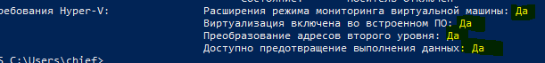
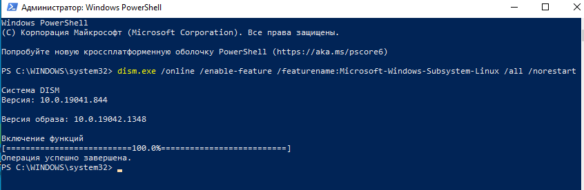
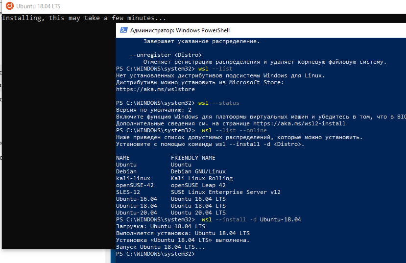
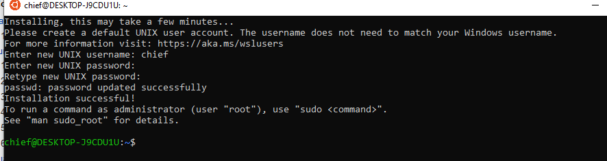

.. _installation_guide:
.. _intro_installation_guide:

Установка Ansible windows 10(wsl)
===================

Далее будет описана установка ansible в Windows 10, используя Windows Subsystem Linux(WSL)

.. contents::
  :local:

Подготовка к установке
-----------------
.. warning::
  На сайте ansible написано что в windows 10 появилась Windows Subsystem for Linux, которая позволяет запустить в среде windows любую linux программу. Команда ansible официально не поддерживается запуск ansible на Windows и данное решение не рекомендуется в production средах!!!

Что из себя представляет эта возможность. По сути это виртуализация, используется гипервизор. Но Microsoft приводит аргументы то что WSL требует значительно меньще ресурсов, чем тот же VirtualBox.Т

Что нужно сделать. По сути подойдут все те же рекомендации что и для установки VirtualBox. Желательно поддержка аппаратной виртуализации. Нужно включить ее в BIOS.

Шаг 1 - Проверьте включена ли виртуализации используя
-----------------

.. code-block:: bash
    Systeminfo.exe

Шаг 1.5 (Обычно не требуется) - Убедитесь что у вас не тормозит дисковая подсистема
--------------

Если загрузка на нее 100% и не снижается. То значит вам нужно сменить стандартные ``драйвера SATA AHCI`` на родные. Без этого я не смог даже запустить установку WSL.

Шаг 2 включить подсистему Windows для Linux
-------------

Если все нормально то идем дальше. Необходимо запустить PowerShell c правами администратора. И включим подсистему Windows для Linux

.. code-block:: bash
    dism.exe /online /enable-feature /featurename:Microsoft-Windows-Subsystem-Linux /all /norestart

Далее перезагрузим систему для того чтобы обновление установилось.

Шаг 3 - Скачивание пакета обновления ядра Linux
---------------

Скачайте пакет последней версии:

[https://wslstorestorage.blob.core.windows.net/wslblob/wsl_update_x64.msi |Пакет обновления ядра Linux в WSL 2 для 64-разрядных компьютеров]

Запустите пакет обновления, скачанный на предыдущем этапе. (Для запуска щелкните дважды. Появится запрос на повышение уровня разрешений. Нажмите кнопку "Да", чтобы утвердить эту установку.)

Шаг 4 - Выбор WSL 2 в качестве версии по умолчанию
------------

Запустите в PowerShell c справами админа

.. code-block:: bash
    wsl --set-default-version 2

Шаг 5 - Установка в качестве репозитария  Ubuntu 18.04
------------

.. code-block:: bash

    wsl --install -d Ubuntu-18.04

При установке понадобится указать логин для linux и пароль

Шаг 6 Установка пакетов в wsl
-----------

Далее в power shell можно набирать

.. code-block:: bash

    wsl

и будет открываться командная строка линукс.

В принципе далее можно воспользоваться  командами для Ubuntu из этой инструкции.

Давайте установим ansible при помощи python

.. code-block:: bash

     sudo apt-get update
     sudo apt-get install python3-pip git libffi-dev libssl-dev libssl1.1 -y
     pip3 install pip --upgrade
     pip3 install --user ansible==2.9

Пример запуска ansible в wsl
-----------

Выводы. Хоть это и не поддерживается производителем ansible я рекомендую ознакомится с данной возможностью.

.. seealso::

  `https://docs.microsoft.com/ru-ru/windows/wsl/install <https://docs.microsoft.com/ru-ru/windows/wsl/install>`_
      Инструкция по установке wsl'''
  `https://docs.microsoft.com/ru-ru/windows/wsl/install-manual <https://docs.microsoft.com/ru-ru/windows/wsl/install-manual>`_
      Инструкция по установке wsl с ручным обновлением до версии 2
  `https://docs.microsoft.com/ru-ru/windows/wsl/troubleshooting <https://docs.microsoft.com/ru-ru/windows/wsl/troubleshooting#error-0x80370102-the-virtual-machine-could-not-be-started-because-a-required-feature-is-not-installed?>`_
      Разбор ошибок при установке
  `https://docs.microsoft.com/ru-ru/windows/wsl/faq#can-i-run-wsl-2-in-a-virtual-machine- <https://docs.microsoft.com/ru-ru/windows/wsl/faq#can-i-run-wsl-2-in-a-virtual-machine->`_
      FAQ по WSL
  `https://docs.microsoft.com/ru-RU/windows-server/virtualization/hyper-v/system-requirements-for-hyper-v-on-windows <https://docs.microsoft.com/ru-RU/windows-server/virtualization/hyper-v/system-requirements-for-hyper-v-on-windows#:~:text=on%20Windows%20Server.-,General%20requirements,the%20processor%20must%20have%20SLAT>`_
      Проверка требований по виртуализации
